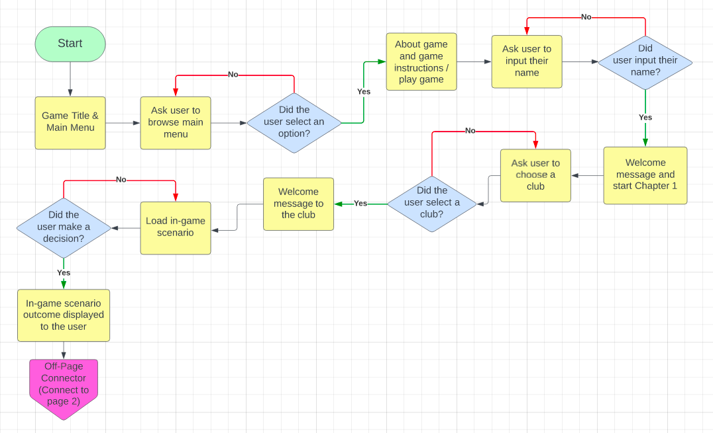
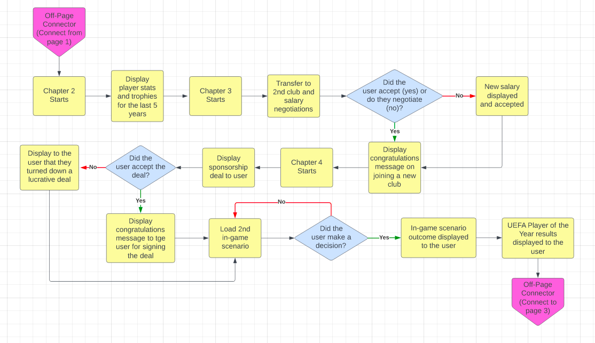
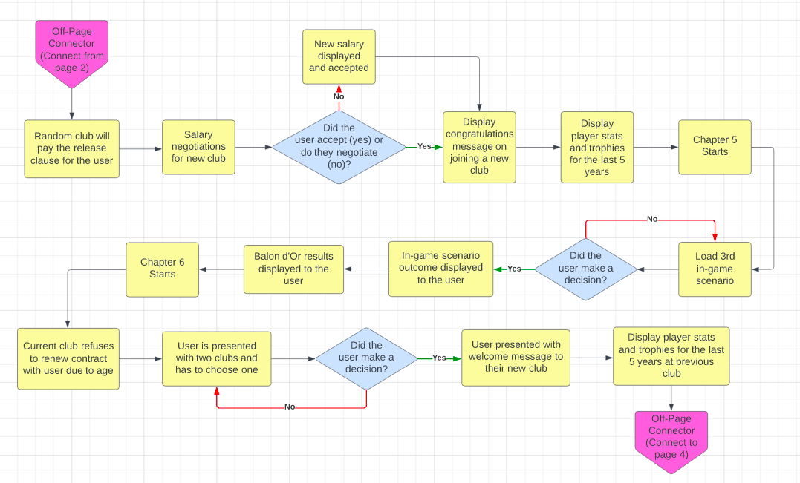
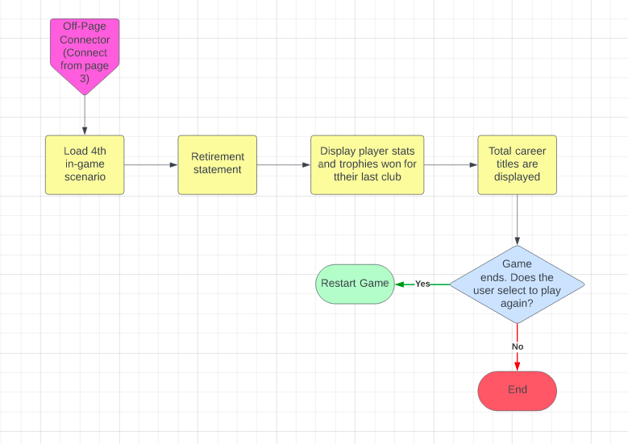
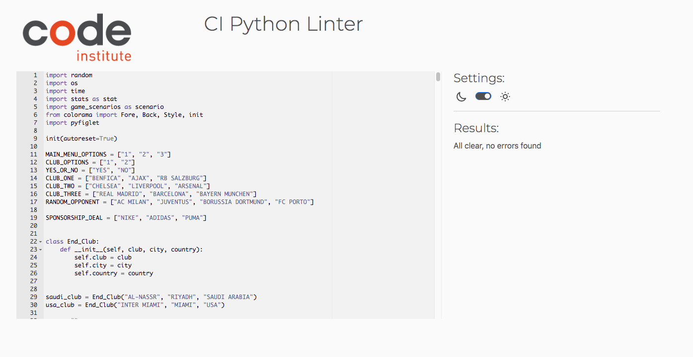
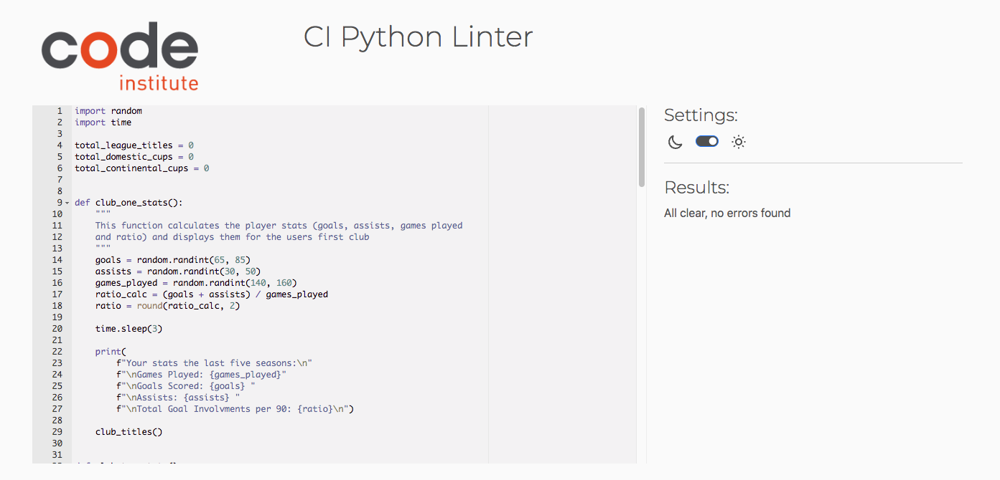
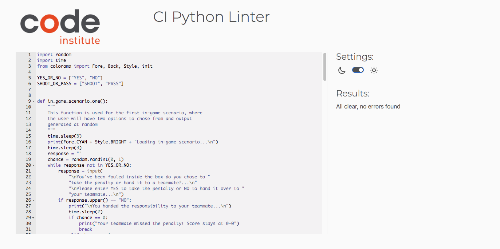

# FOOTY FEVER

Footy Fever is a Python terminal game that runs on Heroku.

The live project can be viewed [here](https://footy-fever-ad7b89b7823a.herokuapp.com/).

Inspiration for this game comes from an existing game called New Star Soccer, which can be downloaded from the App Store and the Google Play Store. In this game you also climb the ranks of football and also take decisions into your own hands.

This game (Footy Fever) was chosen to appeal to its intended target audience, which is football fans of all ages. The game is designed to be a simple and fun game for its target audience. 

### How To Play 

In this game Footy Fever, users will be playing to reach the heights of their footballing career. By starting just out of a youth club and potentially ending up in a whole different continent by the end of the game. Along the way the user will chose clubs that they’ll play for and even take part in salary negotiations. Upon finishing their time at a certain club, they’ll be presented with their stats as a player and all the trophies they’ve won!

* The user can chose the club they want to transfer to once their time with their current club expires. 
* The user can engage in contract negotiations to potentially increase their weekly wages, but risking these negotiations can backfire. 
* The user can chose if they like to sign on to a sponsorship deal. 
* Along the way the user can pick up prestigious footballing awards. 
* The user will be presented with in-game scenarios and they must take control of their actions. 
* By the end of the game the user should have achieved footballing stardom, with incredible personal and team accolades.

## User Experience (UX)

### User Stories

Target Audience: The target audience for this game is anyone that has a keen interest in football and wants to play an online command-line interface fun game. 

As a User I want to:

* play a quick and fun game around an interest of mine
* be able to make decision in a game
* know when i have entered something incorrectly 
* play a game on different devices
* understand how to play the game
* be able to restart the game once finished 
* play a game that is not repetitive if I play it again and again 

### User Experience in this Game

This game will take into consideration the user stories as mentioned above to create a positive UX. The users experience will be shown in deeper detail with examples within the below sections. 

## Features 

### Title Section

* [Pyfiglet](https://pypi.org/project/pyfiglet/0.7/) was installed and import pyfiglet was used to generate ASCII art for the title of the game. 

* The ’Standard’ font was used for the game title as it is large and clear to read, thus the user has clarity on what the game is called. 

* The game title was given a green font, this is so the title stands out and relates it to the game subject. Football pitches are green, hence a green coloured title. 

### Main Menu Section

* Just under the game title, the main menu will be displayed to the user.

* The main menu will have three option to choose from:
    1. About The Game
	2. Game Instructions 
	3. Play Game

* If the user enters ‘1’ they will be displayed with what the game is about, if the user enters ‘2’ they will given instructions on how to play the game. In both options ‘1’ and ‘2’, the user will be instructed to press ‘0’ to return back to the main menu. 

* If the user enters ‘3’, the game will load and then the user will be prompted to enter their name. 

* If the user selects a number that is neither 1, 2 or 3 an error message will be displayed which will state ‘Please enter a number between 1 and 3’. This error message will have red text, thus highlighting to the user that they have given an incorrect input. The main menu will load again so the user can give a correct input. 

### About This Game Section

* If the user decided to view the what the game is about, they will be presented with the title ‘About This Game’ followed by an short explanation of what this game is, what it is centred around and what the ultimate goal is by the end of the game. 

* The title has been given colour to indicate to the user that it is a title. 

* At the end of the ‘About This Game’ explanation, the user will be prompted to enter ‘0’ to be taken back to the main menu, where they can view another game instructions and/or play the game. 

### Game Instructions Section

* If the user decides to view the game instructions, they will be presented with the title ‘Game Instructions’ followed by what is expected of them during the course of the game. 

* The title has been given colour to indicate to the user that it is a title. 

* At the end of the ‘Game Instructions’ explanation, the user will be prompted to enter ‘0’ to be taken back to the main menu, where they can view about this game and/or play the game. 

### Name Input Section 

* Once the user enters ‘3’ on the main menu, the game will load and the user will be prompted to enter their name. 

* The user can chose to either use letters or numbers or a combination of both to create their name. 

* One the name has been accepted, a welcome message with the users name will be displayed. 

* If the user decides to press enter without entering a name, the user will be displayed an error message stating ‘Name must be longer than 0 characters!’. The user will then be prompted again to enter a valid name. The error message will be in red, to convey to the user that an error has occurred. 

### Club Choice Sections

* During the course of this game, the user will be joining a total of four clubs, but the user will only have input on the club selection twice only.

* The users first selection will be for their first club. Chapter 1 starts with the user have a choice of three clubs, which are Benfica, Ajax and RB Salzburg. The user must select one of these clubs by entering one of the club name. If the user enters a valid response, the user will be displayed with a welcome message and stating good luck in the city and county of the club they’ve chosen. If the user enters an invalid response, the user will be displayed an error message starting that they have entered an invalid input and to choose from one club stated, the question will then be displayed again. If the response is validated the game will continue to the next section, which will be an in-game scenario. 

* The users second selection will be for their last club. The user will be displayed with two options and they must enter either ‘1’ or ‘2’. If the user enters a valid response, the user will be displayed with a welcome message. If the user enters an invalid response, the user will be displayed an error message starting that they have entered an invalid input and to chose either ‘1’ or ‘2’, the question will then be displayed again.  If the response is validated the game will continue to the next section, which will be display the player stats and trophies for their third club. 

### In-Game Choices Sections

* During the users time with each club they transfer to, they will be presented with one in-game scenario. 

* The game will need the users input to generate a message to the user and proceed with the game. 

* These four in-game scenarios are as follows: 

	* Scenario 1: The user has been fouled inside the box and a penalty has been awarded, the user can either chose to take it or pass the responsibility to a teammate. If the user decides to take the penalty, there will be two possible outcomes and these outcome are generated by the random function. If the random function gives a ‘0’, it will display to the user that they have missed the penalty. If the random function returns a ‘1’, it will display to the user that they have scored the penalty. Now, if the user decides to hand over the penalty responsibility to a teammate, there will also be two possible outcomes decided by the random function. If it returns a ‘0’ it will be displayed to the user that the teammate missed the penalty. If a ‘1’ is returned, it will display to the user that their teammate scored the penalty. If the user enters something that isn’t a ‘yes’ or a ‘no’, the game will display to the user that they must enter either one of those two options and the question will be displayed again. 

	* Scenario 2: The user has been awarded a freekick, as the clubs appointed freekick taker, the user will have two options, either to take a shot at goal or pass the ball to a teammate. If the user decides to take a shot, there will be two possible outcomes and just like Scenario 1 these outcomes are generated by the random function. If a ‘0’ is returned, it will display to the user that the goal keeper saved the shot, if a ‘1’ is returned, it will be displayed to the user that you score and now your team leads. If the user decides to pass it to a teammate, again, two possible outcomes will be generated. If the random function returns a ‘0’, it will be displayed that an opposition player has tackled your teammate and has won the ball. If it returns a ‘1’, it will be displayed to the user that your teammate headed the ball and they scored. Also, just like in Scenario 1, if the user enters something that isn’t a ‘shoot’ or a ‘pass’, the game will display to the user that they must enter either one of those two options and the question will be displayed again. 

	* Scenario 3: The user sees that an opposition player is running in on goal, the user will have two options, either to tackle or not to tackle. If the user decides to tackle, there will be two possible outcomes and just like the two above scenarios these outcomes are generated by the random function. If it returns a ‘0’, it will display to the user that it was a bad tackle and will give the user a red card. If it returns a ‘1’, it will display to the user that it was an excellent tackle and they won the ball. If the user decides not to tackle, again, two possible outcomes will be generated. If the random function returns a ‘0’, it will display to the user that the opposition player has scored. If it returns a ‘1’, it will display to the user that the goal keeper has saved the shot and the score stays level. Also, just like in above scenarios, if the user enters something that isn’t a ‘yes’ or a ‘no’, the game will display to the user that they must enter either one of those two options and the question will be displayed again. 

	* Scenario 4: The user finds themselves one-on-one with the goalkeeper, but the angle to shoot on goal in narrowing, the user has two options, either to take the shot or pass to a teammate that is in a much better position. If the user decides to shoot, there will be two possible outcomes and just like the above scenarios, these outcomes are generated by the random function. If it returns a ‘0’, it will display to the user that their shot went wide. it it returns a ‘1’, it will display to the user that they have scored and their team now leads. If the user decides to pass to a teammate, again, two possible outcomes will be generated. If the random function returns a ‘0’, it will display to the user that their teammate has shoot the ball over the bar. If it returns a ‘1’, it will display to the user that their teammate got an easy tap in and that their team now leads. Also, just like in above scenarios, if the user enters something that isn’t a ‘shoot’ or a ‘pass’, the game will display to the user that they must enter either one of those two options and the question will be displayed again.

### Stats & Trophies

* Once the user moves club, they will be presented with their stats, which will consist of the following: Games Played, Goals, Assists and Goal Involvement Ratio per Game. The user will also be presented with the number of trophies won with that club, the trophies will be the follwoing: League Title(s), Domestic Cup Title(s) and Contenental Cup Title(s). 

* In Chapter 7, the user will be presented with their total trophies won, it will calculate all the trophies the user won throughout their career.

* There are no inputs needed from the user for this feature. 

### Negotiation Sections 

* There exists two parts in the game where the user will be prompted to either accept the salary given by the club or they can chose to negotiate. These two sections exist when the user goes to their second and third professional club. 

* If the user choses to accept the offer and not negotiate, a welcome to your new club message will be displayed to the user. 

* If the user does decide to negotiate, this could their have a positive impact or a negative impact. If a second random integer generated is higher than the proposed salary, the user will be presented with a message stating that the club is impressed with their negotiations and will offer a higher salary. But, if this second random integer is lower, then the user will be presented with a message stating that the club is not impressed with their negotiations and will offer a lower salary. 

* Another outcome in negotiating the salary, if the second random integer generated happens to be equal to the proposed salary, then the user will be presented with a meagre stating that the club will not negotiate and the proposed salary will stay as initially presented. 

* If the user does not enter either ‘yes’ or ‘no’, an error will be displayed to the user to enter either ‘yes’ or ‘no’. he question will be displayed again for the user to give it a correct input. 

### Sponsorship Choice Section

* From a list of three brands, one will be selected at random and presented to the user.

* The yearly salary from this sponsorship deal will also be displayed as a random integer. 

* The user will have the choice of accepting this deal by entering ‘yes’ or they can reject it by entering ’no.

* If the user enters ‘yes’, a congratulations message will be displayed. 

* If the user enters ‘no’, a message stating that the user turned down a lucrative deal will be displayed. 

* If the user enters something other than ‘yes’ or ‘no’, an error message will pop up prompting the user to either enter ‘yes’ or ’no’. The question will be displayed again for the user to give it a correct input. 

### Awards 

* During the course of the game, there will be two occasions where the user is nominated for awards. 

* A function called award_time() is used to handle both the award sections of the game. 

* As both award sections use the same function, the global keyword has to be called upon to change the name of the award. 

* For award placement, a random number is generated between 1 and 3, if the number generated is a 1, it will display a message to the user congratulating them on the award. If the number generated is a 2, it will display to the user that they placed second and if a 3 is generated, it will display to the user that they played third.

### Play Again

* Once the user finishes the game, they will be prompted whether to end the game or to restart and play again. If the user enters ‘yes’ the game will restart and if ‘no’ is entered the game will end. Both lower and uppercase inputs will be accepted. The user is alerted with an error message if their input is not valid and the option of restarting the game is shown again. 

* If the user decides to play again, they will be taken back to the start. In case the user needs to see the instructions again, they can do so as the main menu will be displayed again. 

* If the user decides to end the game there, then a message thanking the user for playing will be displayed. The game is then quit by using the exit() method. 

* Import os was used in the play_again() function, this was so that the screen will be cleared if the user decides to play again. It ensures that the user has no obstructions when playing a new game. 

* If the user enters neither ‘yes’ or ‘no’, an error message will be displayed stating to the user to enter either ‘yes’ or ‘no’ and the question will be displayed again. 

## Flow Control 

A flow chart is used to show the order in which individual statements, instructions or function calls are executed or evaluated. The below images, the flow of the game is laid out and structured to aid in the design of the control flow statements such as while loops, if-elif-else statements and try-except statements. The flow chart allowed the design of the user input validation checks to be visually clear before the code was written. 

## Aesthetic Design 

### Font

[Pyfiglet](https://pypi.org/project/pyfiglet/0.7/) was installed and import pyfiglet was used to generate ASCII art for the game title. Pyfiglet was added to requirements.txt then for deployment to Heroku. 

The ASCII art used for the game title was chosen with readability for the user in mind, the font was selected using Figlet.org 

Font used: 

Standard - Used for the game title as it is clear for the user to read. 

### Colour 

[Colorama](https://pypi.org/project/colorama/) was installed and import colorama was used to change the font colour and background colour of some words. Colorama was added to requirements.txt then for deployment to Heroku. 

A mix of blue, cyan, yellow and red was used to keep the gameplay interesting and as a visual cue to users for certain feedback and sections. 

## Libraries & Technologies Used

### Built-in Python Libraries 

* random 

The random library was imported to access the built-in method of generating a random number selection using the randint() method. This was used when it came to displaying the following: Weekly Salary, Transfer Amount, Transfer teams, opponents, awards, Trophies Won, In-Game Scenario Outcomes, Player Stats such as Goals, Assists, Games Played and Ratio. 

* time

The time library was imported to access the built-in method of suspending the execution of the current thread for a given number of seconds using the sleep() method. This was used to give the game some structure in how it’s to be presented to the user. If this method wasn’t used, the user would be thrown a large chunk of text all in one go. Using the sleep() method means that the user can digest the text of the game in smaller parts and not lose track of the flow of the game. 

* os 

The os library was imported to create a function to utilise the os.system to clear the terminal. At the end of the game, if the user decided to play again, the terminal will be cleared and the game will start from the beginning. This function will provide a positive user experience as it will make the new game clearer and more structured. 

### External Python Libraries  

* [Colorama](https://pypi.org/project/colorama/) for adding colour to fonts. 

* [Pyfiglet](https://pypi.org/project/pyfiglet/0.7/) for adding ascii art to the game title. 

### Other 

* [LucidCharts](https://lucid.co/) was used to create the Flowchart.

## Testing 

* The print() method was used throughout the development of the game to check for any errors that arose. It helped to check that the game was running/behaving as expected and that functions using the random() method were generating the expected outcome. 

* User inputs were tested by printing it back to the console, this was to ensure all functions were running as expected. 

* Errors and warnings were fixed as they appeared, this was to ensure that the code was kept clean and any bugs that arose could be identified and fixed easier. 

* The game was tested regularly to check that all the functions were linked appropriately, thus having a well structured game that would run smoothly with no interruptions.  

* The external Python library, Pyfiglet, was tested by running the game, it could be seen that the title of the game was displayed was expected. 

* The external Python library, Colorama, was tested by doing a full run of the game, the expected results were: 

	* Green text for the game title, about the game and game instructions. 
	* Blue text for starting and loading game display to the user.
	* Red text for any error messages that might occur throughout the gameplay.   
	* Blue background and yellow text for the chapter titles.

* Total trophies won was tested by keeping count of all trophies won throughout the game, and once the total was displayed at the end of the game, the figures were then compared to see if they matched. The total trophies won was displayed correctly as expected. 

* Testing inputs were used to ensure all user inputs would be handled correctly and would display appropriate feedback to the user. In the features section, it mentions how user inputs were handled. 

	* Main Menu: This will only accept either 1, 2, 3. It was tested by entering other numbers and other random letters to ensure the error was caught and handled appropriately. 

	* Back to Main Menu: This will only accept 0. It was tested by entering anything else other than ‘0’ to ensure the error was caught and handled appropriately. 

	* User Name: This will accept any alphanumeric input given including special characters. The name must also be longer than 0 characters and the strip method is used to remove any white space. It was tested by entering no name to ensure the error was caught and handled appropriately. 

	* Press Enter to Continue…: This will only accept the enter button being pressed. It was tested by entering any other keys on the keyboard to ensure the error was caught and handled appropriately.  

	* First Club Choice: This will only accept one of the three club options presented to the user and will accept any of those clubs typed in lower or uppercase. It was tested by entering anything else that was not one of the three clubs presented to ensure the error was caught and handled appropriately.  

	* Fourth Club Choice: This will only accept either a ‘1’ or a ‘2’. If the user inputs ‘1’, it is expected that they will join the club mentioned first option presented, if they input ‘2’ it is expected that they will join the club mentioned second option presented. This was tested by selecting either option and it performed as expected. If the user inputs neither ‘1’ or ‘2’ an error will be displayed telling the user to enter either ‘1’ or ‘2’. 

	* First & Third In-Game Scenario: This will only accept either a ‘yes’ or a ‘no’ input and will accept any of those responses in lower or uppercase. It was tested by entering anything else that wasn’t either of the two given options to ensure the error was caught and handled appropriately. 

	* Second & Fourth In-Game Scenario: This will only accept either a ‘shoot’ or a ‘pass’ input and will accept any of those responses in lower or uppercase. It was tested by entering anything else that wasn’t either of the two given options to ensure the error was caught and handled appropriately.

	* Negotiations: All negotiation sections will only accept either a ‘yes’ or a ‘no’ and will accept any of those responses in lower or uppercase. It was tested by entering anything else that wasn’t either of the two given options to ensure the error was caught and handled appropriately.

	* Sponsorship: During the game, the user will be prompted to accept or decline a sponsorship deal. This will only accept either a ‘yes’ or a ‘no’ input and will accept any of those responses in lower or uppercase. It was tested by entering anything else that wasn’t either of the two given options to ensure the error was caught and handled appropriately. 

	* Play Again: This will only accept either ‘yes’ or ‘no’. It is expected that if the user inputs ‘yes’ the game will restart, if the user inputs ‘no’ the game will finish and exit. Testing was performed on both these inputs and it performed as expected. It is expected that if any other input is given other than ‘yes’ or ‘no’, the user will be displayed with an error message stating that they must enter a valid input. This was tested by giving it an input that would throw an error and it performed as expected. 

### Validator Testing

[This](https://pep8ci.herokuapp.com/) python validator was used to validate all python files. All python files were checked with no errors. 

Validator Testing results for run.py: 

Validator Testing results for stats.py: 

Validator Testing results for game_scenarios.py: 

## Deployment 

The site was deployed via [Heroku](heroku.com), and the live link for this game can be found here - [Footy Fever](https://footy-fever-ad7b89b7823a.herokuapp.com/)

This project was developed utilising the Code Institute Template. Some of the deployment steps below are specifically required for the new CI template and may not be applicable to older versions, or different projects. 

Before deploying to Heroku, pip3 freeze > requirements.txt was used to add pyfiglet and colorama imports for deployment. 

1. Log into Heroku or create an account if one hasn't been created yet. 

2. Once logged in, click the button labelled 'New' from the dashboard in the top right corner and from the drop-down menu, select 'Create New App'. 

3. A unique app name must be entered, I named mine: Footy Fever. 

4. Next, select your region, as I am based in England, I selected Europe. 

5. Click on the 'Create App' button. 

6. The next page, you will be able to see the project's 'Deploy' tab. Click on the 'Settings Tab' and scroll down to 'Config Vars'. 

7. Click 'Reveal Config Vars' and enter the 'port' into the 'Key' box and '8000' into the 'Value' box and click the 'Add' button. 

8. Next, scroll doen to the Buildpack section, click 'Add Buildpack', select 'Python' and click 'Save Changes'. 

9. Repeat the previous step to add 'Node.js'. Please note that the Buildpacks must be in the correct order. If they are not, click and drag them into the correct order. 

10. Scroll to the top of the page and select the 'Deploy' tab. 

11. Select GitHub as the deployment method. 

12. Confrim that you want to connect to GitHub. 

13. Search for the repository name and click connect button. 

14. Scroll to the bottom of the deployed page and select preferred deployment type:

* Click either 'Enable Automatic Deploys' for automatic deployment when you push update to GitHub or you can choose to select manual deployment and click 'Deploy Branch'. Please note, if you choose manual deployment, it must be deployed everytime you push to GitHub. 

### Version Control 

Git commands were used during the development to push code to the remote repo, the following commands were the following:

* *git add <file>* - This command is used to add a file to the staging area.

* *git commit -m "text"* - This git command is used to commit changes made to the code and sent to the local repository.

* *git push* - This git command is used then the committed code was pushed to the remote repository on GitHub.

## Credits

All code used to develop this game is custom. Some resources were used impliment specific features, these were the following: 

* [Using the strip() method to remove all white spacing from the users input name](https://www.geeksforgeeks.org/python-string-strip/)

* [Using the time sleep() function to aid user experience](https://www.geeksforgeeks.org/sleep-in-python/)

* [Using the round() function to calculate the ratio to two decimal places](https://www.w3schools.com/python/ref_func_round.asp)